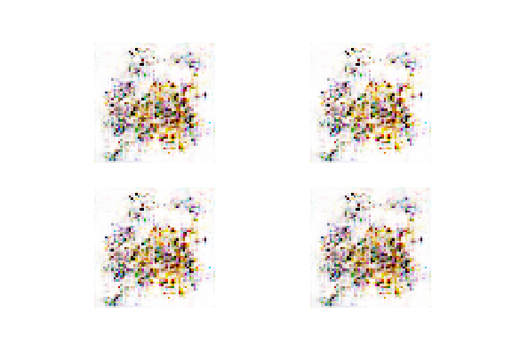
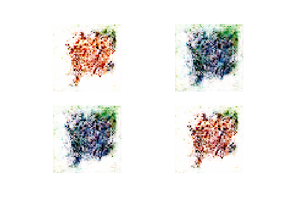
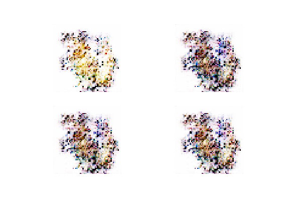

# SpriteGAN
SpriteGAN generates Pokèmon sprites from original 151 Pokèmon Yellow sprites.
It is a implementation of DCGAN using the keras library.

Deep Convolutional Generative Adversarial Network consists of two networks: 
* Generator - tries to generate fake images from noise so as to fool the discriminator network
* Discriminator - tries to distinguish real images from fake ones

# Dependencies
* [Keras (Tensorflow Backend)](https://keras.io/)
* Numpy
* ImageIO
* [Jupyter](http://jupyter.readthedocs.io/en/latest/install.html)

# Usage
1. Download and install Jupyter Notebook and IPython kernel
1. run a Jupyter environment locally using ``` jupyter notebook ``` in the terminal
1. set ``` path ``` variable in ``` model_train ```
1. set save location in ``` save_imgs() ``` 
1. set ``` use_prev ``` to false to use pretrained models
1. call ``` model_train ``` for atleast 10 epochs to generate novel sprites

# Example Output






# References
* [Unsupervised Representation Learning with Deep Convolutional Generative Adversarial Networks](https://arxiv.org/abs/1511.06434)
